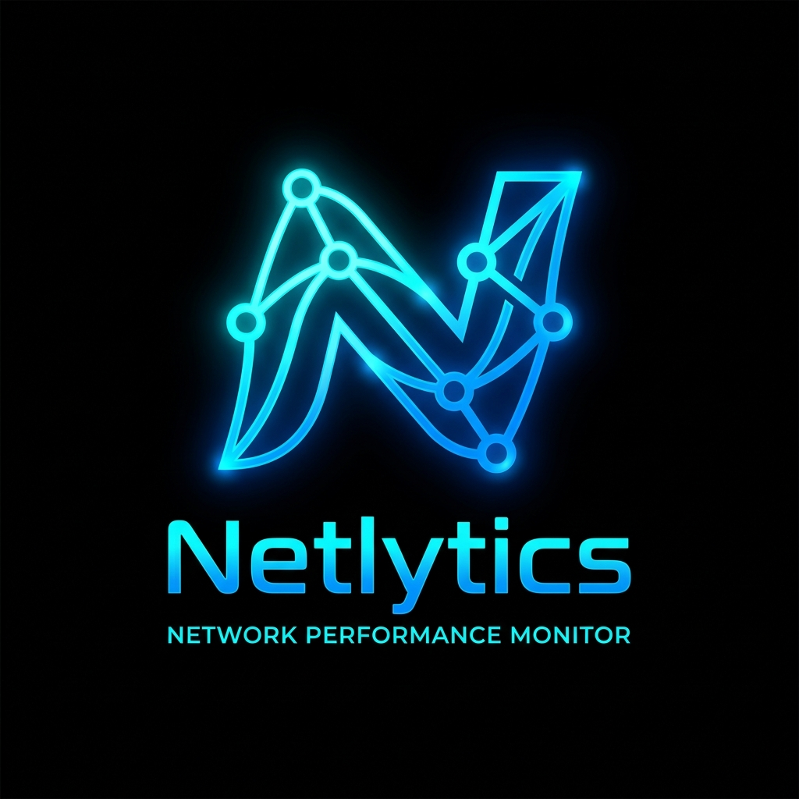
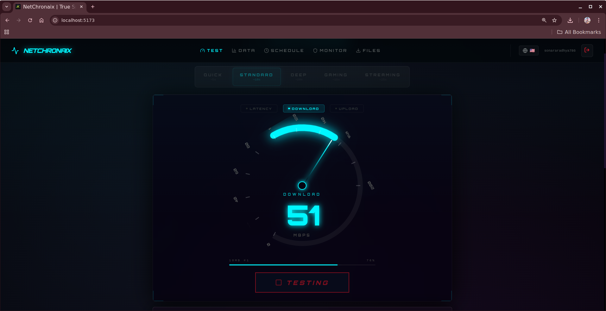
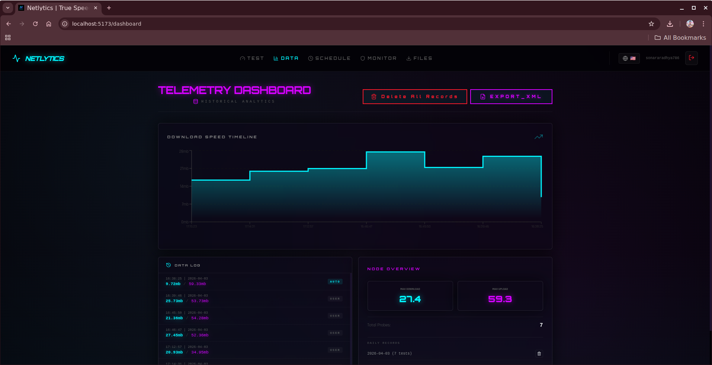
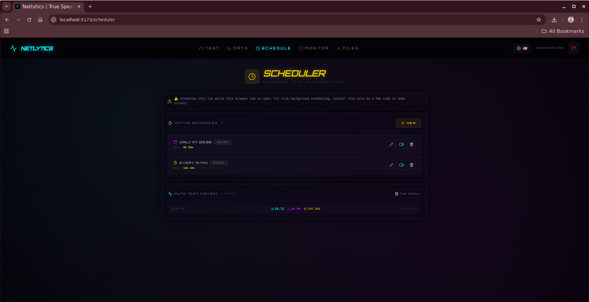
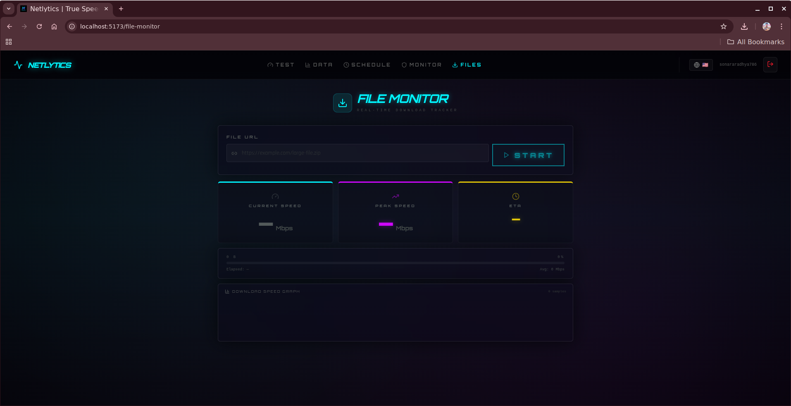

<div align="center">
  

  # 🌐 NetChronaix Zenith V10
  ### *An Advanced Network Intelligence Platform for Real-Time Telemetry & Analysis*

  <p>
    
    
    
    
  </p>

  <b>Transform raw network data into actionable insights.</b>

  <br/><br/>

  [🚀 Features](#-key-features) • 
  [🧠 Problem & Solution](#-the-problem) • 
  [⚔️ Comparison](#️-why-netchronaix-stands-out) • 
  [🏗 Architecture](#-technical-architecture) • 
  [⚙️ Installation & Setup](#-installation--setup) • 
  [🎯 Use Cases](#-real-world-use-cases) • 
  [👨‍💻 Author](#-author)
</div>

---

## 🧠 Overview

**NetChronaix Zenith V10** is a **next-generation network monitoring and analytics platform** tailored for developers, gamers, and system analysts seeking **in-depth visibility into network performance**.

In contrast to conventional speed testers, NetChronaix offers:
- Real-time telemetry
- AI-enhanced diagnostics
- Historical analytics
- Professional reporting tools

> ⚡ *Stop speculating about your network performance. Start measuring it intelligently.*

---

## 📸 Product Showcase

<div align="center">
  
  <p><i>High-precision speed testing engine with progressive probing</i></p>

  
  <p><i>AI-powered diagnostics with real-time health scoring</i></p>

  
  <p><i>Advanced telemetry dashboard with historical insights</i></p>

  
  <p><i>Automated scheduler for continuous monitoring</i></p>

  
  <p><i>Live file transfer monitoring with ETA prediction</i></p>
</div>

---

## 🚨 The Problem

Modern internet users often depend on outdated tools that only address a single question:

> *"What is my speed right now?"*

However, real-world performance encompasses much more:

- ❌ Lack of visibility into **jitter spikes**
- ❌ Inability to detect **packet loss**
- ❌ No understanding of **network stability over time**
- ❌ No means to **prove ISP underperformance**
- ❌ No actionable insights — merely raw numbers

⚠️ Result: Users experience lag, buffering, and instability **without understanding the cause**

---

## 💡 The Solution — NetChronaix Zenith

**NetChronaix Zenith converts raw network tests into intelligent diagnostics.**

Rather than providing a mere snapshot, it delivers:

- 🧠 **AI-driven analysis** → Comprehend *why* your network behaves as it does  
- 📊 **Continuous telemetry** → Monitor performance over time  
- 🗺️ **ISP congestion insights** → Recognize peak throttling periods  
- 📄 **Proof-based reporting** → Create professional audit reports  
- ⚡ **Real-time anomaly detection** → Identify issues before they affect you  

> 🚀 *Transition from “checking speed” → to “understanding network behavior”*

---

## ⚔️ Why NetChronaix Stands Out

| Feature                  | NetChronaix Zenith | Speedtest | Fast.com |
|--------------------------|-----------------|----------|----------|
| Speed Measurement        | ✅              | ✅       | ✅       |
| Jitter Analysis          | ✅              | ❌       | ❌       |
| Packet Loss Detection    | ✅              | ❌       | ❌       |
| AI-Based Insights        | ✅              | ❌       | ❌       |
| Historical Tracking      | ✅              | ❌       | ❌       |
| ISP Congestion Heatmaps  | ✅              | ❌       | ❌       |
| Proof Reports (PDF)      | ✅              | ❌       | ❌       |

> 🥇 NetChronaix is not merely a tester — it is a **comprehensive network intelligence system**

---

## 🚀 Key Features

### 🧠 AI Network Intelligence
- Real-time Network Health Score (0–100)
- Natural language performance summaries
- Automatic anomaly detection

### 📊 Telemetry & Analytics
- Historical performance tracking
- Visualization of jitter, latency, and packet loss
- Multi-session comparisons

### 🗺️ ISP Congestion Analysis
- Time-of-day performance insights
- Identification of throttling patterns
- Weekly trend analysis

### 📄 Reporting System
- Generate professional PDF reports
- Share performance audits with ISPs
- Detailed performance logs

### 🎮 Multi-Profile Testing
- Gaming Mode → latency-focused
- Streaming Mode → throughput-focused

### ⏱️ Smart Scheduler
- Automated test intervals
- Continuous monitoring
- Zero manual effort

---

## 🏗 Technical Architecture

| Layer            | Technology |
|------------------|-----------|
| Frontend         | React 19 + Vite |
| Backend          | Supabase (PostgreSQL + Auth + Realtime) |
| Visualization    | Recharts |
| Reporting        | jsPDF + AutoTable |
| Styling          | CSS3 (Glassmorphism UI) |
| Engine           | Custom Fetch/XHR Probing Logic |

---

## 🔒 Security & Privacy

- 🔐 Row Level Security (RLS)
- 🔑 Secure environment variables
- 💾 Local persistence for performance
- 🚫 No unauthorized data exposure

---

## ⚙️ Installation & Setup

### 1️⃣ Clone Repository
```bash
git clone https://github.com/sonararadhya/NetChronaix.git
cd NetChronaix
npm install
```

### 2️⃣ Configure Environment
```env
VITE_SUPABASE_URL=your_project_url
VITE_SUPABASE_ANON_KEY=your_anon_key
```

### 3️⃣ Run Application
```bash
npm run dev
```

---

## 🎯 Real-World Use Cases

### 🎮 Gamers
- Detect micro-lag, jitter spikes, and unstable ping  
- Optimize connection for competitive gameplay  

### 📡 Remote Workers
- Ensure stable Zoom/Meet calls  
- Identify hidden instability affecting productivity  

### 🏢 ISPs & Network Providers
- Analyze congestion patterns over time  
- Validate infrastructure performance  

### 👨‍💻 Developers & Engineers
- Debug API latency and backend delays  
- Monitor real-world network conditions  

### 📊 Researchers & Analysts
- Collect structured telemetry data  
- Conduct trend analysis and performance modeling  

---

## 🌟 Why This Project Matters

- Merges **network engineering + AI intelligence**
- Addresses **real-world connectivity challenges**
- Developed with a **modern production-grade stack**
- Emphasizes **performance, user experience, and analytics**
- Showcases **full-stack + system design expertise**

---

## 👨‍💻 Author

**Aradhya Sonar**  
*Full-Stack Developer | AI Enthusiast | Network Systems Builder*

📍 Pune, India  
🔗 GitHub: https://github.com/sonararadhya  
💼 LinkedIn: https://www.linkedin.com/in/aradhya-sonar/

---

<div align="center">
  <h3>🚀 Built with precision, performance, and passion</h3>
  <p>If you found this project useful, consider ⭐ starring the repository</p>
</div>

---
*📝 Last maintained: September 08, 2026 at 11:39 UTC*
